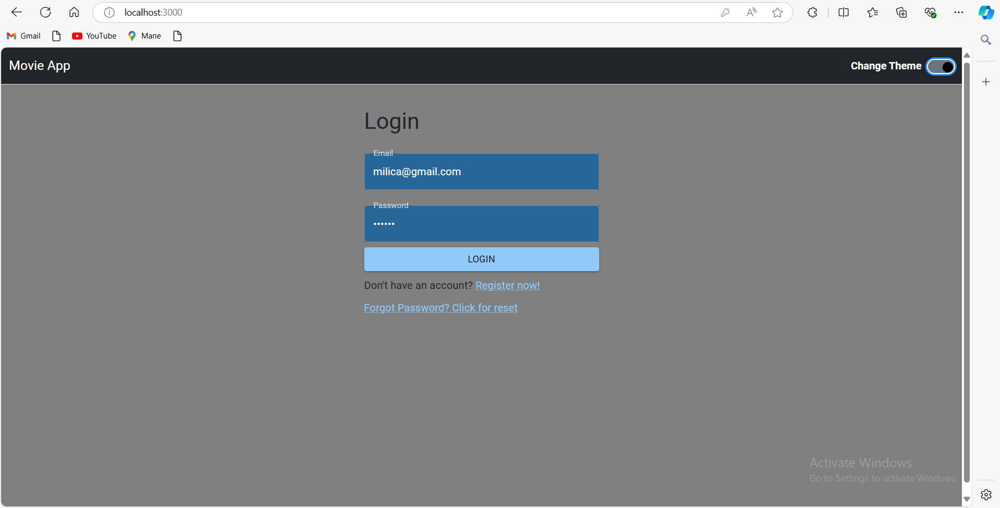
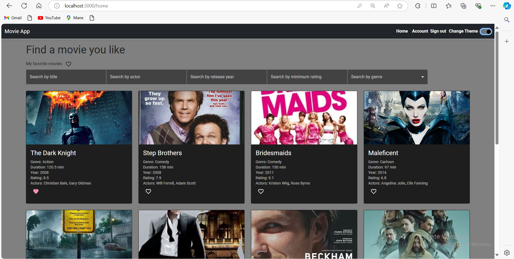
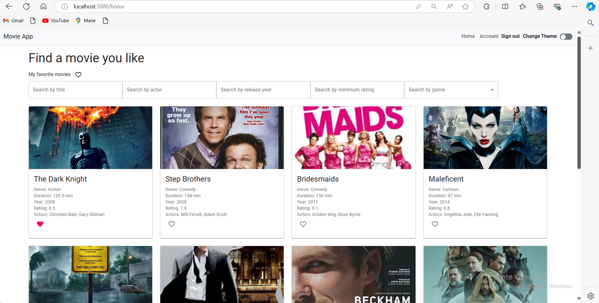
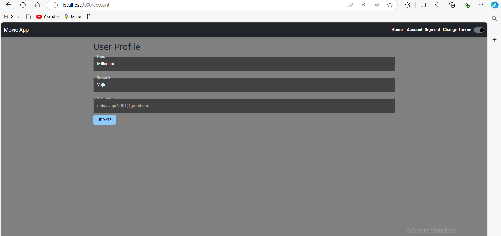
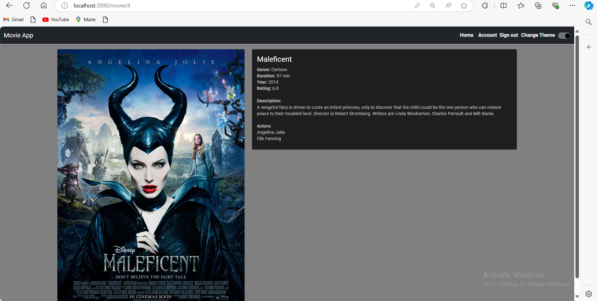
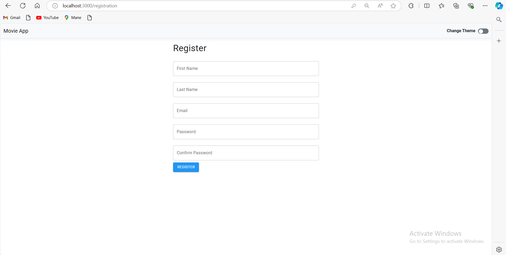

# Movie Management Progressive Web Application

This project is a **Progressive Web Application (PWA)** developed for managing movies. It includes features like movie browsing, marking favorites, searching, filtering, theme switching, and offline capabilities. Users can also log in, register, reset passwords, and edit their accounts. The application supports offline functionality and allows users to download it as a desktop app.

## Features

- **View Movies**: Browse through a collection of movies.
- **Mark Favorites**: Add movies to your list of favorites.
- **Search and Filter**: Quickly find and filter movies based on various criteria.
- **Theme Switching**: Toggle between different themes (light/dark mode).
- **User Authentication**: 
  - Log in
  - Register
  - Reset password
  - Edit account details
- **Offline Mode**: The app works seamlessly even when offline.
- **Downloadable as a Desktop App**: Install and use the app directly from your desktop.

## Technologies Used

- **Backend**: Developed with `.NET 7` for the server-side functionality.
- **Frontend**: Built with `React` using the `Material-UI` library for UI components.
- **Client App**: Dockerized for easy deployment and scaling.
- **Firebase**

## Prerequisites

- **.NET 7 SDK**: Make sure you have the .NET 7 SDK installed on your machine.
- **React**: React should be installed on your system.
- **Docker**: Docker is required to build and run the client application.

## Installation and Setup

### 1. Clone the Repository

```bash
git clone https://github.com/MilicaVujic/movie_web_app
cd movie_web_app
```

### 2. Run the .NET Backend

Navigate to the root of the project:

```bash
cd movie_web_app
dotnet run
```

### 3. Build and Run the React Client with Docker

Navigate to the `ClientApp` directory:

```bash
cd ClientApp
docker build --tag react .
docker compose up
```

### 4. Access the Application

Once the client is running, open your browser and navigate to:

```
http://localhost:3000
```

## Some pages
- 
-
-
-
-
-
-
